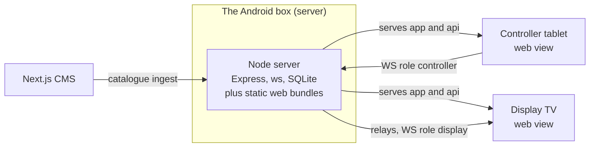
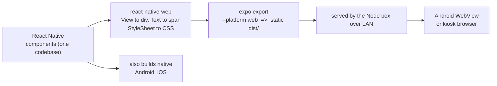
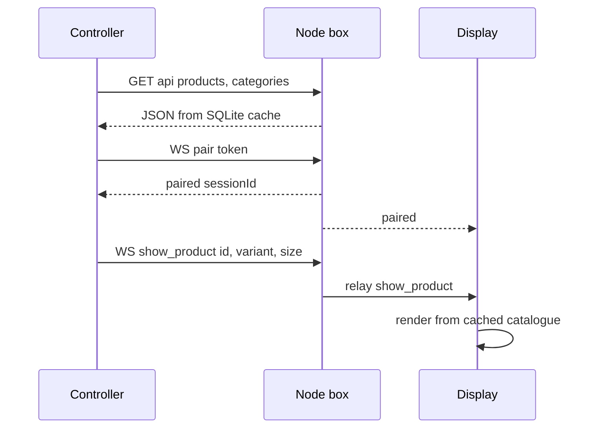
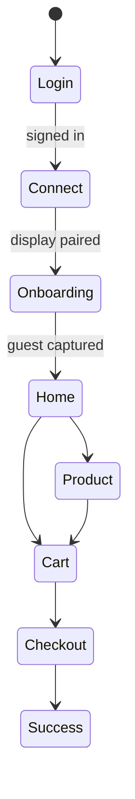

# Ebani Showroom — Architecture & Web View

The two Flutter apps are now **React Native (Expo SDK 57)**, rendered to the browser
through **react-native-web** and shown inside a **web view** — same architecture, same
backend (the Node box + CMS).

---

## 1. Repository layout

```
Fashion_app/
├─ server/            Node: Express + ws + better-sqlite3      ← the box (backend)
│   └─ src/ http/ ws/ services/ repositories/ ingest/
├─ cms/               Next.js — content team edits the catalogue
├─ shared/schema.sql  the SQLite data shape (contract)
├─ PROTOCOL.md        the frozen WebSocket contract
│
├─ frontend/          original Flutter — kept for reference
│   ├─ display_app/       (Dart)
│   └─ mobile_app/
│
└─ frontend-rn/       NEW — React Native (Expo + web)
    ├─ display_app/       TV showroom screen
    └─ mobile_app/        salesperson controller / POS
```

### Inside each RN app (same layering as Flutter: repositories → controllers → screens)

```
src/
├─ config/     appConfig            backend host/port, mode switch
├─ theme/      colors · typography · tokens · icons · ThemeProvider
├─ models/     money · product · cart · customer · order · wsEvent · …
├─ data/       CatalogRepository (HTTP + bundled) · auth · checkout · customer · journey
├─ realtime/   RealtimeService + Backend*Realtime     WebSocket client
├─ core/       Listenable + useListenable             state pattern
├─ features/   auth · connection · onboarding · catalog · product ·
│              cart · checkout · customer · recommendations · presentation
└─ app/        providers (DI) · RootNavigator · App root
```

**State** — Flutter's `ChangeNotifier` + provider became a tiny `Listenable` class consumed
through React's `useSyncExternalStore` (`useListenable` / `useListenableSelector`). Same
controllers, same imperative logic, same `notifyListeners()`.

---

## 2. System topology

One **Android box** in the boutique is the whole backend: it serves the apps, owns the
catalogue + session (SQLite), relays messages, and runs offline during a live session. A
**display** (TV) and a **controller** (tablet) connect to it. The controller tells the
display what to show; the display renders from its own cached catalogue — never mirroring.



---

## 3. How the web view works  ← the key part

A React Native app is normally compiled to native iOS/Android. Here it's compiled **to the
browser** and shown in a web view.



1. **react-native-web** maps RN primitives to the DOM — `<View>`→`<div>`, `<Text>`→`<span>`,
   `StyleSheet`→CSS, touch handlers → pointer events. We write RN components once.
2. `expo export --platform web` produces a self-contained static `dist/` (an `index.html`
   + a JS bundle, no server of its own).
3. The **Node box serves that bundle** as static assets over the LAN (it already serves the
   built display/controller assets and `/media/*`).
4. On the **TV**, the display bundle runs full-screen in an Android **System WebView** (or a
   kiosk browser). On the **tablet**, the controller runs the same way.
5. Because the page is served **by the box**, it's **same-origin** with the box, so the
   display's `AppConfig` reads `window.location` and connects to `/api` + `/ws` with zero
   setup. The controller keeps a *Server settings* sheet to set the LAN IP on a real device
   (fallback `10.0.1.45:3000`).

**Why a web view instead of native**

- One bundle updates every screen on the floor at once — reload the page, ship the change.
  No app-store deploy.
- The **same React Native code still builds to a real native Android/iOS app** when a
  hardware feature needs it (camera QR, kiosk lock).
- Offline-first is intact: bundle + the box's SQLite cache means a live session never
  touches the internet.

---

## 4. Runtime data flow

Two channels: **HTTP** loads the CMS-fed catalogue; one **WebSocket** carries the live
session. The controller's rich event vocabulary is translated down to the frozen
`PROTOCOL.md` command set the server relays.



---

## 5. Controller navigation — the guarded flow

Flutter's `go_router` redirect guards became React Navigation conditional screen groups: the
visible stack is a function of auth + pairing + onboarding state.



---

## 6. Stack & boundaries

| Layer | Technology | Responsibility |
|---|---|---|
| Display & Controller | React Native · Expo SDK 57 · react-native-web | The two web-view apps (TV + tablet); also buildable to native |
| Navigation | React Navigation (native-stack) | Guarded flow — replaces `go_router` |
| State | `Listenable` + `useSyncExternalStore` | Controllers — replaces `ChangeNotifier` + provider |
| Realtime | Browser `WebSocket` | Pairing + live presentation per `PROTOCOL.md` |
| Catalogue | `fetch` → `/api/*` | Products, recommendations, customers, checkout, journey |
| Server | Node · Express · ws · better-sqlite3 | Serves apps, relays WS, owns session + offline cache |
| Content | Next.js CMS | Catalogue authoring, ingested into the box's SQLite |
| Device features | expo-camera · expo-video · react-native-svg | QR scan (manual fallback on web), model video, QR render |

Verified statically (apps not run): `tsc --noEmit` clean on both, `expo export --platform web`
bundles both with no errors, all `/api` + `/ws` messages checked against the live server source.
